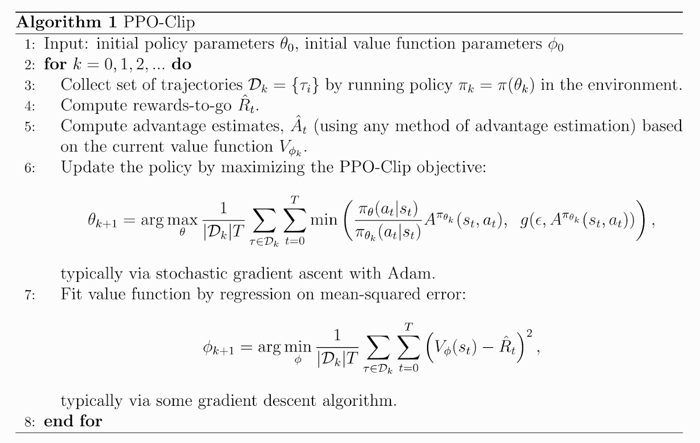
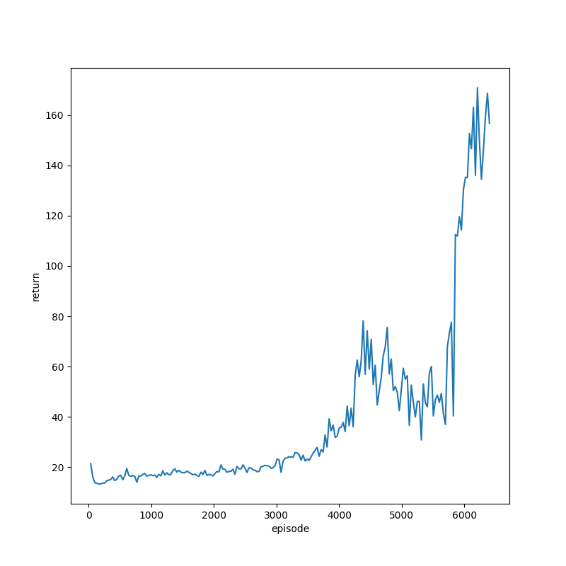
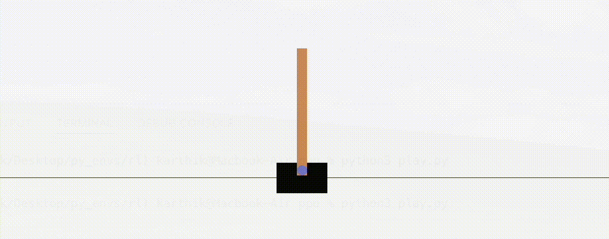
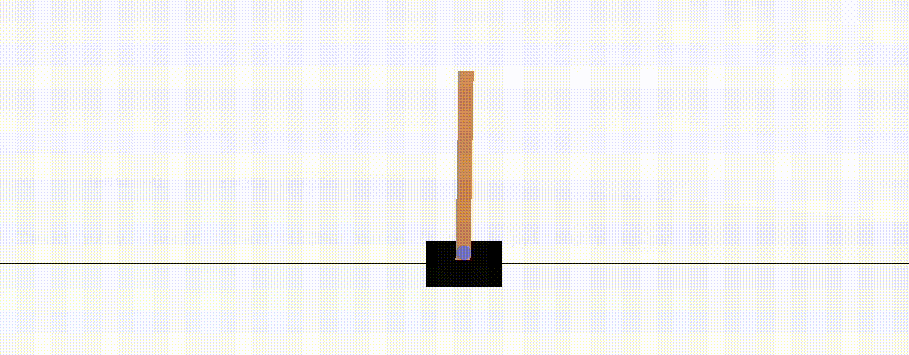

# ppo

PPO stands for Proximal Policy Optimization. It was introduced by OpenAI in this [paper](https://arxiv.org/abs/1707.06347) and was intended as an improvement over TRPO. Check out this [blog](https://openai.com/blog/openai-baselines-ppo/) as well.

I don't know why it's taking longer to train than vanilla policy gradient. But it's definitely improving, so the implementation works.

Before training...

After training...

